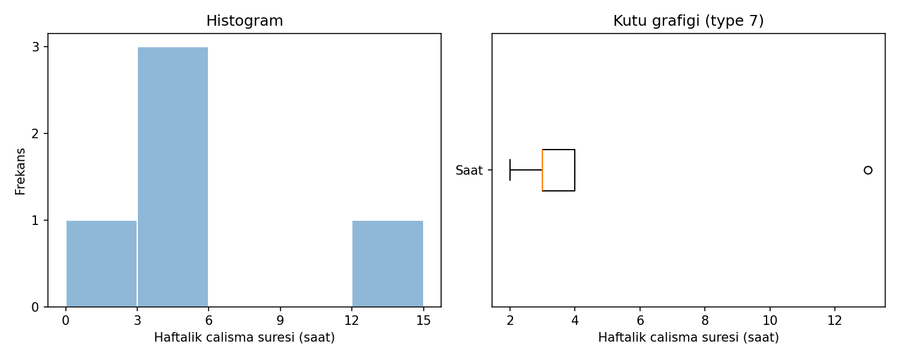

# Grafik açıklaması

**Kaynak:** Beş yapay gözlem içeren `veri.csv` (2, 3, 3, 4, 13 saat).
Görsel Python betiğiyle üretilmiştir; bir R veya SPSS ekran görüntüsü değildir.

Sol panelin yatay ekseni çalışma süresi (saat), düşey ekseni frekanstır.
Sınıflar [0,3), [3,6), [6,9), [9,12), [12,15]; son sınıf sağ ucunu içerir.
İki boş sınıf süreler arasındaki boşluğu korur. Düşey eksen sıfırdan başlar.

Sağ panel type 7 çeyrekleriyle çizilmiştir. Kutu 3 ile 4, medyan 3,
bıyık uçları 2 ve 4'tür. 13 saat açık daireyle işaretlenir. Medyan çizgisi
kutunun sol kenarına, üst bıyık sağ kenarına denk gelir. Bu çakışmalar
çizim hatası değildir. 1,5 ve 5,5 sınırları grafikte ayrıca çizilmemiştir.

`python cozum.py --check --grafik` görseli yeniler. R betiğinin grafik
seçeneği aynı veri özetlerinden ayrı dosya üretmek üzere hazırlanmıştır;
R çıktısı bu ortamda üretilmemiştir. Yazılımlar arasında yazı tipi ve çizgi
biçimi farklı olabilir; temel kontrol sayısal özetlerdir.