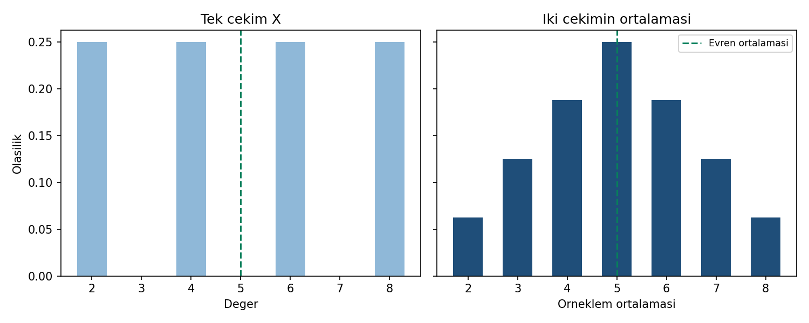

# Dağılım grafiği açıklaması

Görsel Python ile `evren.csv` ve `veri.csv` dosyalarından üretilmiştir.
R/SPSS ekran görüntüsü değildir. İki panel aynı yatay ve düşey ölçeği
kullanır; düşey eksen sıfırdan başlayan **olasılık** eksenidir, yoğunluk değildir.

Sol panelde tek çekimin dağılımı, sağ panelde n=2 örneklem ortalamasının
tam dağılımı görülür. Sağdaki merkez değerlerin daha çok çift tarafından
üretildiği ve uç ortalamaların daha az olası olduğu görülür. Yeşil kesikli
çizgi iki panelde de 5'tir. Sağ panelin standart sapması yaklaşık 1,5811,
sol panelinki yaklaşık 2,2361'dir. Uç değerler hâlâ mümkündür; daha küçük
standart hata, minimum ve maksimumun mutlaka daralması demek değildir.

`python cozum.py --check --grafik` görüntüyü yeniler. R betiği aynı olasılıkları
ayrı bir dosyaya çizecek şekilde hazırlanmıştır, fakat burada çalıştırılmadı.
SPSS'in yerleşik tek panel sütun grafiği yüzdeleri gösterir; sayısal
karşılaştırmada yüzdeler 100'e bölünmelidir. Piksel eşitliği beklenmez.