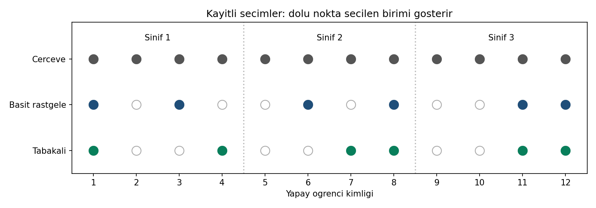

# Seçim haritası

Görsel ortak CSV'den Python ile üretilmiştir; R/SPSS çıktısı değildir.
Çerçeve satırındaki gri noktalar bütün birimleri; seçim satırlarında dolu
noktalar seçilenleri, içi boş noktalar seçilmeyenleri gösterir. Dikey
ayraçlar 1–4, 5–8 ve 9–12 kimliklerinden oluşan sınıfları ayırır.

İki seçim de bu kayıtta her sınıftan iki kişi içerir fakat kimlikler aynı
değildir. 1,8,11,12 iki seçimde de bulunur; 3 ve 6 yalnız basitte, 4 ve 7
yalnız tabakalıdadır. Tasarımlar birbirinden bağımsız iki gerçek öğrenci
grubu oluşturmuş gibi yorumlanmaz.

İçi boş nokta, bu çekimde seçilmemeyi ifade eder; o kişinin tasarım
olasılığı sıfır değildir. Harita seçim sonucunu gösterir, olasılık grafiği
değildir. Ayrıca tek bir dengeli basit örneklem, sürekli denge garantisi değildir.

Yenilemek için `python cozum.py --check --grafik` kullanın. R aynı CSV'den
ayrı grafik üretecek şekilde hazırlanmıştır; bu ortamda çalıştırılmadı.