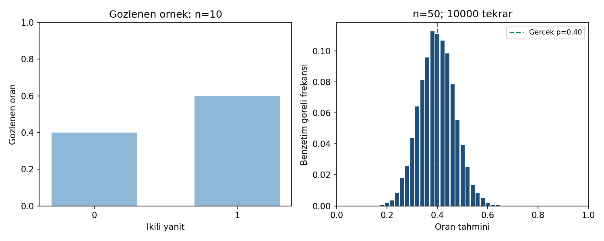

# Oran tahmini grafiği

Görsel iki ortak CSV'den Python ile üretilmiştir; R/SPSS ekran görüntüsü değildir.
Sol panel bir örneğin ikili yanıtlarını, sağ panel ayrı bir modelde çok sayıda
örnekten hesaplanan oran tahminlerini gösterir. İki panelin satır birimleri
ve yatay eksenlerinin anlamları farklıdır.

Sağda olası tahminler 0, 1/50, 2/50, …, 1 noktalarındadır. Her sütun bu
noktanın benzetimdeki göreli frekansıdır; **yoğunluk değildir**, sütun
alanlarının değil yüksekliklerinin toplamı 1'dir. Sıfır frekanslı değerler
dahil bütün 0–1 aralığı korunur. Yeşil kesikli çizgi gerçek model oranı 0,40'tır.

Sol sütunun 0,6 olması sağdaki modeli değiştirmez; on gözlemli örnek ile
p=0,40 benzetimi ayrı öğretim çalışmalarıdır. Sağdaki ampirik merkez 0,398418,
ampirik SE yaklaşık 0,069615'tir. Benzetim, tek bir tahminin her zaman
parametreye eşit olmadığını görselleştirir; tek başına genel yansızlık kanıtı değildir.

Yenileme: `python cozum.py --check --grafik`. R aynı veriden ayrı grafik
üretecek şekilde hazırlanmıştır, fakat burada çalıştırılmadı. SPSS'in
yerleşik histogramı farklı sınıflar kullanabilir; piksel eşitliği beklenmez.