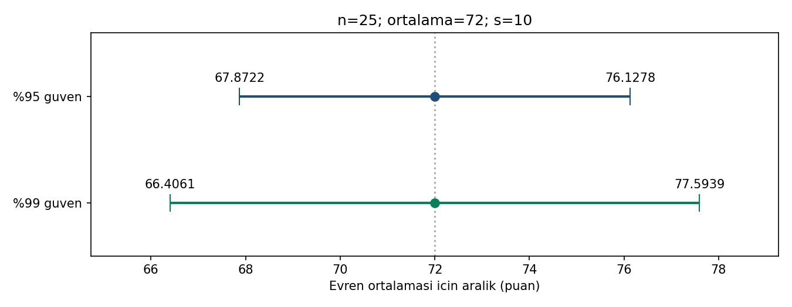

# Güven aralıkları grafiği

Görsel ortak özet CSV'sinden Python ile üretilmiştir; R/SPSS ekran görüntüsü
değildir. Üst çizgi yüzde 95, alt çizgi yüzde 99 güven aralığıdır. Noktalar
her ikisinde de örneklem ortalaması 72'yi; uç çizgileri aralık sınırlarını
belirtir. Kesikli dikey çizgi 72 referansıdır, bilinen gerçek parametre değildir.

İki aralık aynı yatay ölçeği kullanır. Yatay eksen ortalama için puan
ölçeğidir; dikey konum yalnız güven düzeylerini ayırır. Bu bir frekans
veya olasılık grafiği değildir; 25 ham gözlemi göstermediği gibi bu
öğrencilerin yüzde 95/99'unun puanlarını da sınırlandırmaz.

Yüzde 99 çizgisinin uzunluğu yaklaşık 11,1878; yüzde 95 çizgisinin uzunluğu
8,2556'dır. Yüksek güven düzeyi, aynı özetle daha geniş aralık demektir.
Bu iki çizgiden ampirik kapsama oranı ölçülmez; bir benzetim yapılmadı.

Yenileme: `python cozum.py --check --grafik`. R aynı özetle ayrı grafik
üretecek şekilde hazırlanmıştır; burada çalıştırılmadı.