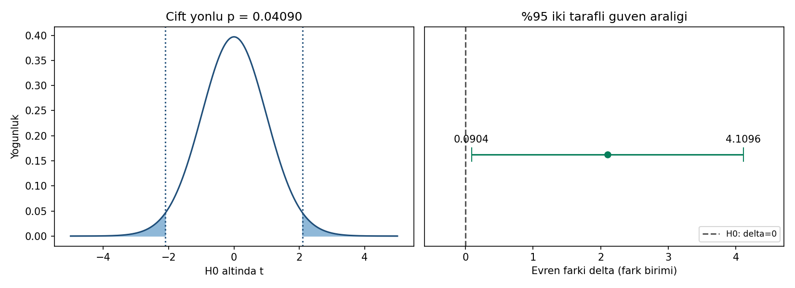

# Grafik açıklaması

**Sol panel:** H0 altında df=49 t yoğunluğu çizilir; bu, gözlenmiş verilerin
histogramı değildir. Noktalı çizgiler gözlenen istatistiğin mutlak değeri
olan ±2,1'i gösterir. Mavi alanlar |T|≥2,1 kuyruklarının görünür kısmıdır.
Toplam kuyruk olasılığı yaklaşık 0,04090'dır. Çizgiler kritik ±2,0096
sınırları değildir; boyalı alan α=0,05 ret bölgesi olarak okunmamalıdır.
Grafik sonlu eksende çizilir, sayısal p-değeri ise sonsuza uzanan kuyrukları
hesaba katar; resimdeki alan piksel sayılarından p hesaplanmaz.

**Sağ panel:** Yeşil nokta 2,1 fark tahminini, yatay çizgi yüzde 95 güven
aralığı [0,0904; 4,1096]'yı gösterir. Kesikli dikey çizgi δ0=0'dır.
Alt sınır sıfıra yakındır fakat pozitiftir. Aralık sıfırı içermez.
Yatay eksen farkın birimidir; p-değeri ekseni değildir.

Grafik renkten bağımsız olarak çizgi biçimleri, sayısal etiketler ve bu
metinle okunabilir. Python çıktısı `python cozum.py --grafik` ile yeniden
üretilir. R betiği çalıştırıldığında benzer grafiği
`ciktilar/r/test-ve-aralik.png` olarak yazar; bu ortamda R grafiği üretilmedi.