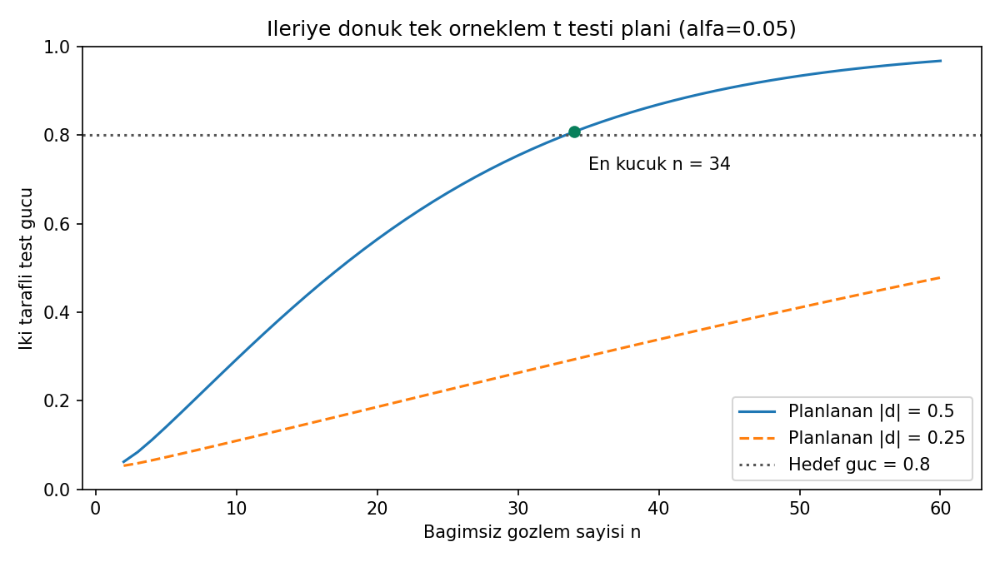

# Güç eğrisi: erişilebilir açıklama

Yatay eksen bağımsız gözlem sayısı, dikey eksen çift yönlü testin gücüdür.
α=0,05 sabittir. Düz mavi çizgi planlanan |d|=0,5'i, kesikli çizgi bunun
yarısı olan |d|=0,25'i gösterir. Noktalı yatay çizgi hedef güç 0,80'dir;
işaretli n=34 noktası ilk eğride yaklaşık 0,8078'e karşılık gelir.

n=34 sabitken daha küçük farkın gücü yaklaşık 0,2934'tür. Daha küçük
etki için %80 hedefe ulaşmak 128 gözlem gerektirir; bu nokta özgün grafiğin
2–60 aralığının dışındadır. Çizgi parçaları tam sayı hacimlerindeki
hesapları birleştirir; kesirli sayıda katılımcı önerilmez.

Bunlar yeni çalışma varsayımları altında teorik eğrilerdir; gözlenen
örneklemin p-değerleri veya benzetim frekansları değildir. Tohum kullanılmaz.
Grafik yalnız `plan.csv` girdilerini kullanır; `veri.csv` ortalamasını
değiştirmek grafikteki planı değiştirmez. Renk yanında çizgi biçimleri,
açıklama ve sayısal değerler de ayrımı sağlar.

Yeniden üretim: `python cozum.py --grafik`. R çalıştırıldığında
`ciktilar/r/guc-egrisi.png` üretir; R grafiği bu ortamda üretilmedi.