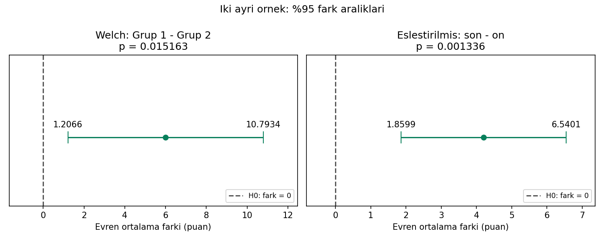

# Grafik açıklaması

Sol panel bağımsız Grup 1−Grup 2 farkını gösterir: merkez 6,00 puandır.
Sağ panel ayrı bir eşleştirilmiş örnekte son−ön farkını gösterir:
merkez 4,20 puandır. Yeşil noktalar tahminleri, yatay çizgiler yüzde 95
ortalama fark aralıklarını, kesikli dikey çizgiler sıfır farkı gösterir.
Aralık uçları ve çift yönlü p-değerleri sayısal etiketlerle belirtilmiştir.

Panellerin **yatay ölçekleri farklıdır**; çizgilerin resimdeki uzunluğu
üzerinden belirsizlik karşılaştırılmaz. Bunlar aynı kişilere iki farklı
testin uygulanması değildir. p-değerlerini veya aralıkların örtüşmesini
karşılaştırarak test seçilmez ya da etkilerin farkı sınanmaz.

Ham çiftler olmadığı için kişi bazlı ön/son çizgileri veya dağılım
histogramı üretilmemiştir. Grafik varsayım kontrolü değil, özet hesapların
gösterimidir. İşaret ve sayısal etiketler rengi ayırt etmeden de okunabilir.

Yeniden üretim: `python cozum.py --grafik`. R çalıştırıldığında
`ciktilar/r/fark-araliklari.png` üretir; R grafiği bu ortamda üretilmedi.
Girdi yönü yeniden tanımlanırsa rapor ve grafik yön etiketleri de buna göre
uyarlanmalıdır; özgün etiketler Grup 1−Grup 2 ve son−ön tanımlarına aittir.