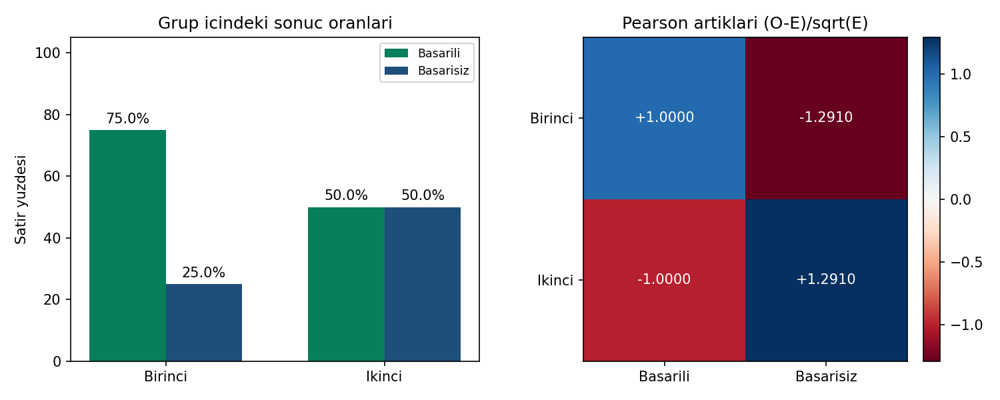

# Grafik açıklaması

Sol panelde her grubun kendi toplamı paydadır: Birinci grubun çubukları
%75 başarılı ve %25 başarısız, ikinci grubunki %50 ve %50'dir.
Her gruptaki iki yüzde 100'e tamamlanır; dört çubuğun toplamının 100 olması
beklenmez. Bunlar ham sayım değil satır yüzdeleridir; güven aralığı çizilmez.

Sağ panelde sıfır merkezli renk ölçeği Pearson artıklarını gösterir.
Mavi pozitif (beklenenden fazla), kırmızı negatif (beklenenden az) sayımı
belirtir. İşaretli sayısal etiketler renkleri ayıramayan okuyucuya da aynı
bilgiyi verir. Bunlar R `stdres` veya SPSS `ASRESID` değildir.

Renkli hücreler ayrı ayrı anlamlı ilan edilmemiştir. Görsel örüntü,
genel Pearson testi, satır yüzdeleri ve araştırma tasarımıyla birlikte
okunmalıdır. Ham kişi bilgisi, zaman sırası veya nedensellik grafikten çıkarılamaz.

Yeniden üretim: `python cozum.py --grafik`. R çalıştırıldığında
`ciktilar/r/oranlar-artiklar.png` üretir; R grafiği bu ortamda üretilmedi.