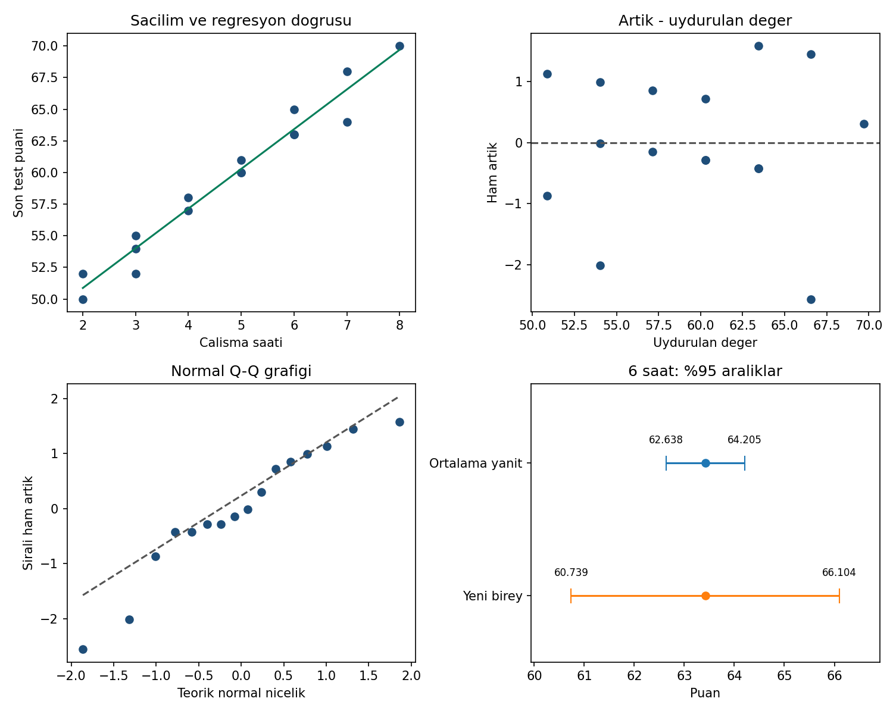

# Grafik açıklaması

- **Sol üst:** 2–8 saatte saat/puan çiftleri ve regresyon doğrusu. Aynı
  koordinattaki kayıtlar üst üste gelebilir; görünür nokta sayısı N değildir.
  Çizgi yalnız gözlenen saat aralığında gösterilir.
- **Sağ üst:** Yatayda uydurulan değer, dikeyde ham artık bulunur. Sıfır
  çizgisi referanstır. Eğrilik ve değişen yayılım araştırılır; grafik tek
  başına bağımsızlığı veya sabit varyansı kanıtlamaz.
- **Sol alt:** Sıralı ham artıklar teorik normal niceliklerle karşılaştırılır.
  Kesikli çizgi birinci/üçüncü çeyrekleri temel alır. Özellikle alt kuyruktaki
  iki negatif artık çizgiden ayrılır; 16 gözlemle normallik kesin ilan
  edilmez veya kayıtlar otomatik silinmez. Bu, standartlaştırılmış artık grafiği değildir.
- **Sağ alt:** Aynı 63,4216 puan merkezindeki iki %95 aralık karşılaştırılır.
  Ortalama yanıt [62,6385;64,2047], yeni birey [60,7387;66,1044] aralığıdır.
  Sayısal etiketler ve satır adları renk olmadan da ayrımı sağlar.

Q-Q grafiğinde Python, R'nin normal olasılık noktaları ve doğrusal
çeyreklik yaklaşımıyla uyumlu bir kurulum kullanır; R grafiği bu ortamda
üretilmedi. Formal normallik testi, etki ölçüsü/Cook uzaklığı veya modelin
harici doğrulaması yapılmış gibi yorumlanmamalıdır.

Yeniden üretim: `python cozum.py --grafik`. R çalıştırıldığında
`ciktilar/r/regresyon-tani.png` üretir.