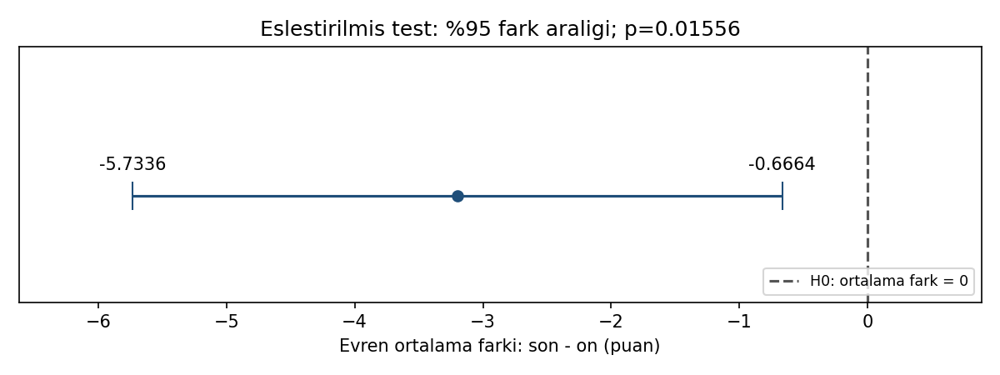

# Grafik açıklaması

Nokta ortalama fark −3,2'yi, yatay çizgi yüzde 95 **evren ortalama farkı**
aralığını gösterir. Kesikli dikey çizgi H0'daki sıfır farktır.
Aralığın tamamen solda olması, son−ön tanımıyla negatif ortalama değişim
için kanıt olduğunu gösterir; her kişinin puanının düştüğü anlamına gelmez.

Bu çizgi bireysel farkların %95'ini kapsayan bir dağılım veya birey öngörü
aralığı değildir. Ham farklar verilmediğinden histogram/Q-Q veya kişi
bazlı ön/son çizgileri üretilmemiştir. İşaretli uç etiketleri görselin
renk olmadan da okunmasını sağlar.

Yeniden üretim: `python cozum.py --grafik`. R çalıştırıldığında
`ciktilar/r/son-on-araligi.png` üretir; bu ortamda R grafiği üretilmedi.
Fark ön−son olarak yeniden tanımlanırsa rapor ve grafik yön etiketleri de
uyarlanmalıdır; pozitif/negatif işaret kendi başına iyi/kötü anlamına gelmez.